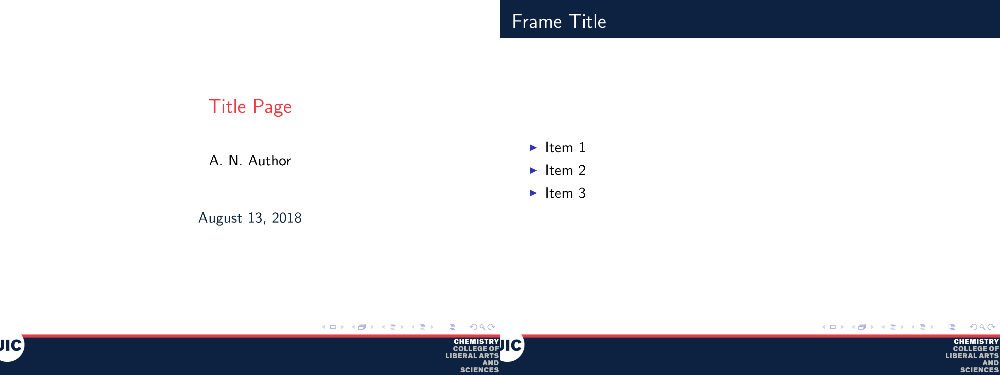
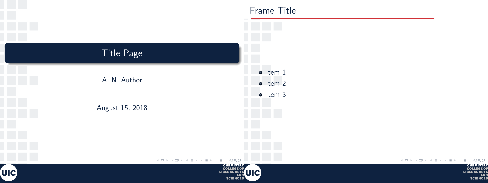
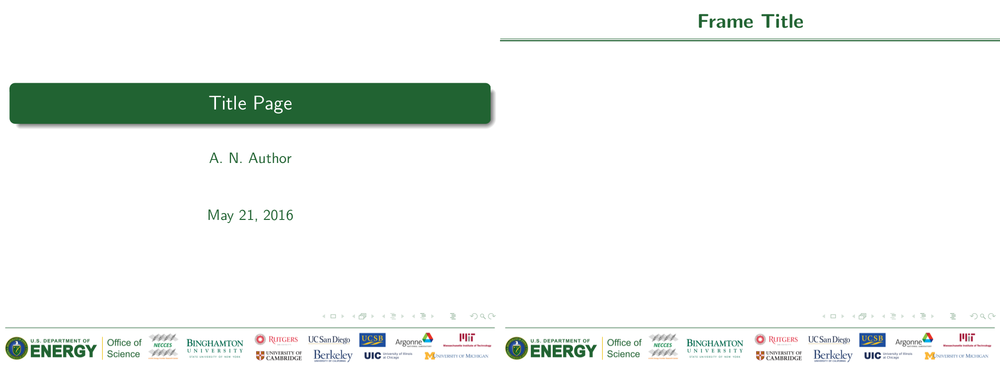
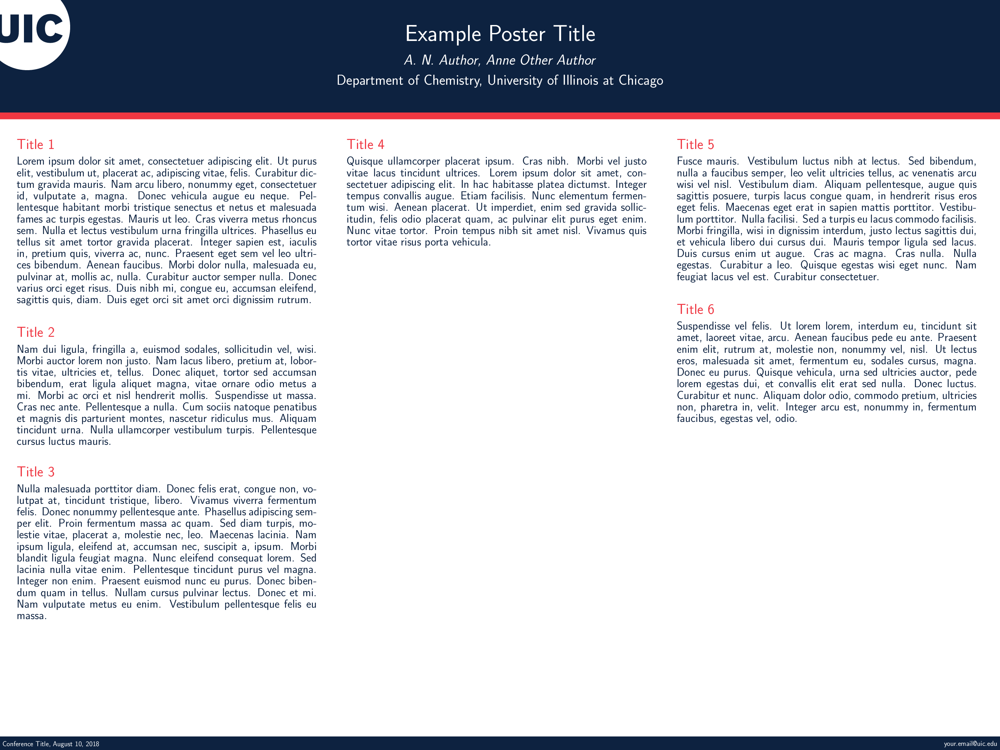

# Cabana/UIC TeX Templates

## Installation

### Linux
Clone this repository to `~/texmf/tex`

## Examples

### UICclean (or UIC1)
```
\usetheme{UICclean}
```

 

### UIC2
```
\usetheme{uic2}
```

 

### NECCES
```
\usetheme{necces}
```

 

### UICpostertheme
Designed for landscape 4ft x 3ft posters

```
\usetheme{UICpostertheme}
```


