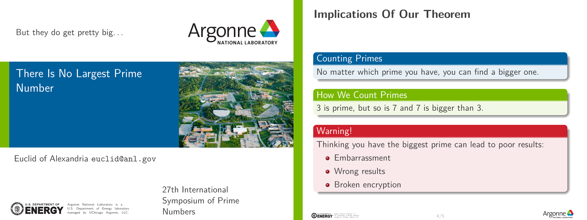

# Examples

## UICclean (or UIC1)
```tex
\usetheme{UICclean}
```

 

### Options
Usage:
```tex
\usetheme[options]{UICclean}
```

`framenumbering` - Adds frame numbers to the footline of each slide

## UIC2
```tex
\usetheme{uic2}
```

 

## NECCES
```tex
\usetheme{necces}
```

 

## Argonne National Laboratory
```tex
\usetheme{anl}
```

> [!WARNING]
> This theme is not endorsed by Argonne National Laboratory, the
> U.S. Department of Energy, or Argonne UChicago LLC. It is provided
> here for informational purposes only.

Where possible, this theme was prepared according to the Argonne
Identity Guidelines and to mirror the official power-point template
provided by Argonne's creative design team. Two known exceptions
exist.

The guidelines specify *Proxima Nova* and *Kepler* as primary
typefaces, and *Arial* and *Times* as secondary typefaces. Since none
of these are open-source fonts, they are not used here. The default
font (Latin Modern sans) looks similar to *Proxima Nova* (and a lot
better than Arial).

In the official powerpoint template, transition slides between
sections contain an aerial view of Argonne in the background. Beamer
does not have a built-in way to designate a slide as a transition
between sections without making specific assumptions about what should
be in this slide. In the future, this will likely be handled with a
special frame option for transition slides, but for now this feature
is unavailable.


