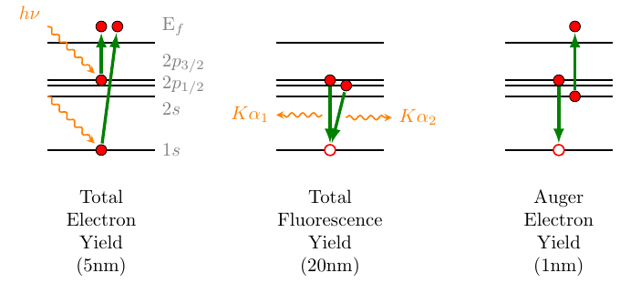
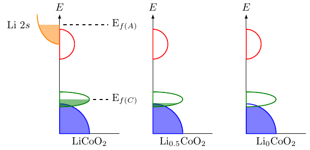

# Examples

## XAS
```tex
%% Preamble
\usepackage{standalone}
...
%% Document
\input{xas.tex}
```

 

## Density of States
```tex
%% Preamble
\usepackage{standalone}
...
%% Document
\input{density_of_states.tex}
```

 
